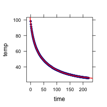
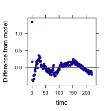

Is Cooling Exponential?
========================================================


We often model temperature change as an exponential process: the object temperature approaches the ambient temperature (room temperature) exponentially.  

Stan Wagon examined the temperature of a cup of coffee over time.  Heated initially to near boiling, it gradually cooled to room temperature.


```r
library(mosaic, quietly = TRUE)
trellis.par.set(theme = col.mosaic())
coffee = fetchData("stan-data.csv")
xyplot(temp ~ time, data = coffee)
```

 


You can see that the function is roughly exponential and can estimate the ambient temperature directly from the graph, as well as the initial temperature near 100 C.

To check how close the function is to being exponential, we can find the parameters of an exponential function that are a close match and plot the fitted function along with the data.  Note that the guess for the numerical value of the exponential time constant $k$ is based on an eye-balled half-life of 40 minutes.


```r
mod = fitModel(temp ~ A + B * exp(-k * time), data = coffee, start = list(A = 70, 
    B = 30, k = log(2)/40))
```


The ```start``` list gives some guessed values for the parameters.  Having such a guess makes it easier for the computer to find the optimal parameters.  Here they are, along with a new plot:


```r
mod
```

```
## function (time, A = 27.0044582029391, B = 62.13545433946, k = 0.0209644103144356) 
## A + B * exp(-k * time)
## <environment: 0x101caea68>
## attr(,"coefficients")
##        A        B        k 
## 27.00446 62.13545  0.02096 
```

```r
xyplot(temp ~ time, data = coffee)
plotFun(mod(time) ~ time, add = TRUE, col = "red")
```

 

#### QUESTION:
1. What's the ambient temperature according to the model?
2. How would describe the quality of the fit of the model?

Plotting the difference between the data and the model can highlight deficiencies in the model:


```r
xyplot(I(temp - mod(time)) ~ time, data = coffee, ylab = "Difference from model")
plotFun(0 ~ time, add = TRUE, col = "red")
```

 

If the model were right on, the points would fall on the zero line.  They differ systematically, which suggests that there is a systematic process that isn't being captured with the model.

#### QUESTION:
What about the process of pouring nearly boiling coffee in a mug not produce an exactly exponential form?

## Sums of Exponentials

The failure of the model to capture the rapid temperature change at early times suggests that there is a fast cooling process that lasts for only a little while.  Perhaps the coffee is cooling in two different ways.  We can try out a sum of exponentials to model this.


```r
mod2 = fitModel(temp ~ A + B * exp(-k * time) + C * exp(-kfast * 
    time), data = coffee, start = list(A = 70, B = 30, k = log(2)/40, kfast = log(2)/5))
mod2
```

```
## function (time, A = 23.5873734328862, B = 48.0610451059924, k = 0.0135075237534055, 
##     kfast = 0.0816543084014399, C = 25.2092494188443) 
## A + B * exp(-k * time) + C * exp(-kfast * time)
## <environment: 0x1027582a8>
## attr(,"coefficients")
##        A        B        k    kfast        C 
## 23.58737 48.06105  0.01351  0.08165 25.20925 
```


```r
xyplot(temp ~ time, data = coffee)
plotFun(mod2(time) ~ time, add = TRUE, col = "red")
```

 

```r
xyplot(I(temp - mod2(time)) ~ time, data = coffee, ylab = "Difference from model")
plotFun(0 ~ time, add = TRUE, col = "red")
```

 


#### QUESTIONS:
1. What's the ambient temperature according to the sum-of-exponentials model?
1. In what ways is the sum-of-exponentials model better?  In what ways worse?
2. How would you quantify the quality of the fit?
3. How would you decide whether the improved fit is worthwhile?  Propose a method.
4. If you were to add in a third exponential, what would you choose as the half-life?
