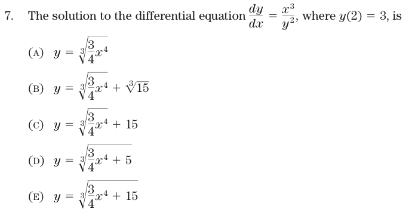

Algebra and Differential Equations
========================================================
```{r echo=FALSE,message=FALSE,warning=FALSE,results="hide",label="options",echo=FALSE}
require(knitr, quietly=TRUE)
library(mosaic,quietly=TRUE)
trellis.par.set(theme=col.mosaic())
```

Here's an AP Calculus exam question in differential equations:



#### QUESTION

When have you ever seen a differential equation of this form used?

What is this problem about?

* NOT ... where the equation is coming from or situations in which the equation might be relevant as a model.
* NOT ... teaching about an important form of differential equation.
* Separating people who can do the steps of the problem from people who can't!

#### The Solution
1. Translate to a pair of integrals: $\int y^2 dy = \int x^3 dx$
2. Compute the integrals: $\frac{1}{3} y^3 = \frac{1}{4} x^4 + C$
3. Solve: $y = \sqrt[3]{\frac{3}{4} x^4 + C}$
4. Evaluate at $x=2$ to set $C$ so that $y(2)=3$, that is: $C = 27 - \frac{3}{4} 2^4 = 15$

There are many ways to make a mistake.  How do you know if you have it right?  By getting one of the answers, unless they tricked you by anticipating the mistake you made.

#### Other ways to do this problem.

* Evaluate each of the expressions at $x=2$ to see which ones give $y(2)=3$:
```{r}
ya = makeFun( ((3/4)*x^4)^(1/3) ~ x )
yb = makeFun( ((3/4)*x^4)^(1/3) + (15)^(1/3) ~ x )
yc = makeFun( ((3/4)*x^4)^(1/3) + 15 ~ x )
yd = makeFun( ((3/4)*x^4 + 5)^(1/3) ~ x )
ye = makeFun( ((3/4)*x^4 + 15)^(1/3) ~ x )
c( ya(2), yb(2), yc(2), yd(2), ye(2))
```

* Differentiate the Ansatze and check which ones match the differential equation:
```{r}
x = 1:5
yf = ya; dydx = D(yf(x)~x)
dydx(x) - x^3 / yf(x)^2
yf = yb; dydx = D(yf(x)~x)
dydx(x) - x^3 / yf(x)^2
yf = yc; dydx = D(yf(x)~x)
dydx(x) - x^3 / yf(x)^2
yf = yd; dydx = D(yf(x)~x)
dydx(x) - x^3 / yf(x)^2
yf = ye; dydx = D(yf(x)~x)
dydx(x) - x^3 / yf(x)^2
```
(b) and ( c ) don't satisfy the equation.  Now at least we know the form of the solution!

Turning Modeling into Algebra
------------------------------

Here is [part of] the treatment given in *MathQuest Maths C Year 12 for Queensland*, 

We will begin by stating ...

$$\frac{dN}{dt} = a N - b N^2 $$ ...
From this we may say
$$\int \frac{dN}{N(a-bN)} = \int dt$$
Consider breaking the expression $\frac{1}{N(a-bN)}$ into partial fractions 

 ... *a half page later* ...

$$\int \frac{dN}{N(a-bN)} = \int \left( \frac{1/a}{N} + \frac{b/a}{a-bN} \right) dN$$

 ... *another half page of algebra* ...

With some algebraic manipulation, it follows that :
$$N(t) = \frac{\frac{a}{b}N_0}{N_0 + \left( \frac{a}{b} - N_0 \right) e^{-at}}$$

Two significant features emerge from this solution:

Feature 1: $\lim_{\rightarrow \infty} N(t) = a/b$.  This value is called the *limiting population*.

Feature 2: *a long paragraph later* ... $N_{maximal} = \frac{a}{2b}$.


Similar treatments are given in many textbooks and on the web [web example](http://www.ugrad.math.ubc.ca/coursedoc/math101/notes/moreApps/logistic.html):

-----------------

A video about the logistic equation.  Finding what time the population will reach 450 when it starts from 500 and the carrying capacity is 400.  As the speaker says, "It's really more just algebraic than anything."  He finds $t=0.75$.  

<iframe width="210" height="167" src="http://www.youtube.com/embed/oVhzzIgBKmo" frameborder="0" allowfullscreen></iframe>

-----------------

Perhaps better to use the computer rather than a calculator.
```{r}
pop = integrateODE( dP ~ 0.8*P*(1-P/K), P=500, K=400, tdur=1 )
findZeros( pop$P(t) - 450 ~ t, t.lim=c(0,1) )
```

Or, 
``` {r}
findZeros( K/(1-.2*exp(-.8*t)) - 450~t, K=400, t.lim=c(0,1))
```

Which answer is right?
