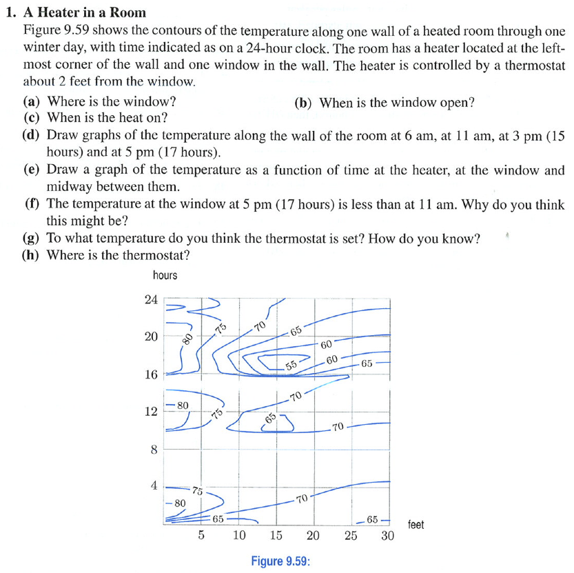
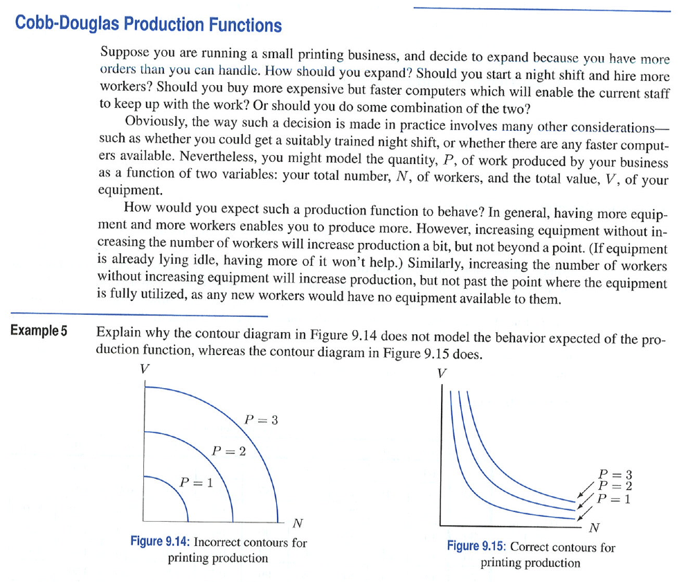

Interpreting Contour Plots
===========================

```{r echo=FALSE,results="hide",label="options",echo=FALSE}
require(knitr, quietly=TRUE)
opts_chunk$set(fig.width=3,fig.height=3,out.width="3in")
```

```{r warning=FALSE,error=FALSE,message=FALSE,results="hide",echo=FALSE}
library(mosaic,quietly=TRUE)
trellis.par.set(theme=col.mosaic())
```



Source: Hughes-Hallett et al. *Applied Calculus* 4/e, p. 396

Partial Derivatives
-------------------



Source: Hughes-Hallett et al. *Applied Calculus* 4/e, p. 357


