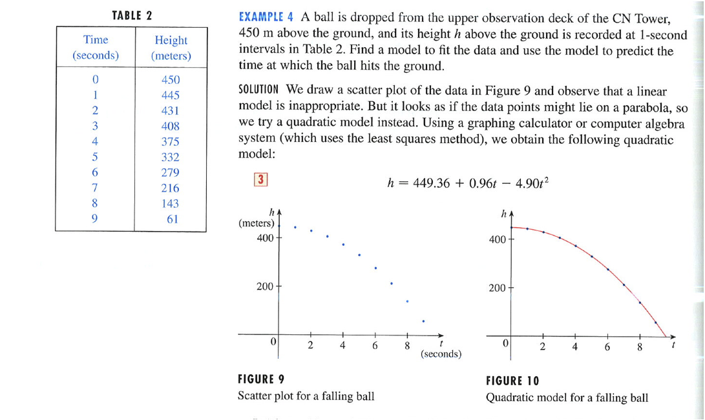

Ballistics and Quadratics
=========================

```{r warming=FALSE,message=FALSE,echo=FALSE,results="hide",label="options",echo=FALSE}
require(knitr, quietly=TRUE)
opts_chunk$set(fig.width=3,fig.height=3,out.width="3in")
library(mosaic,quietly=TRUE)
trellis.par.set(theme=col.mosaic())
```
A problem from Stewart *Calculus: Concepts and Contexts* 2/e p. 30.  



### Questions

* Is the formula stated in the problem the same as one gets by fitting the data in the table?
* According to the formula, what is the ball velocity at $latex t=0$.
* Fit the quadratic model and find the time when the height is zero.
* Why a quadratic model?
* How would air resistance be expected to change things?  (Hint: terminal velocity)

```{r message=FALSE}
Ball = fetchData("PREP-Toronto-ball.csv")
modHeight = fitModel( Height ~ a*Time^2 + b*Time + c, data=Ball)
findZeros(modHeight(t)~t, t.lim=c(5,15) )
```

An *a priori* model:
```{r}
apriori = makeFun( 450 - .5*9.806*Time^2 ~ Time)
```


How good are the models?
```{r}
aprioriResids = with(data=Ball, Height - apriori(Time))
fittedResids = with(data=Ball, Height - modHeight(Time))
plotPoints( fittedResids ~ Time, data=Ball)
```

### Questions:
* Why might the first residual be expected to be larger than the others?  (Hint: How do you synchronize the measurement time with the release time?)
* What pattern in the a priori model suggests that the initial velocity was not zero?
* Are the residuals big or small for real data?  How would you decide?  


Do some research on "terminal velocity" to figure out what would be an appropriate terminal velocity for a ball.  One equation you may find is $$latex V_t = \sqrt{\frac{2 m g}{\rho A C_d}},$$ where $latex m$ is the mass of the ball, $latex g$ the acceleration due to gravity, $latex \rho$ the density of air, $latex A$ the cross-sectional area of the ball, and $latex C_d$ the "drag coefficient."  You should be able to find values for each of these and a plausible range of values for $latex m$ and $latex A$ for a "ball."  For a sphere, the drag coefficient is $C_d = 0.47$.

* Is there any time where, according to the data or the model formula, the velocity is greater than terminal velocity?

### Going further

Build a differential equation with a reasonable model of air drag.  In particular, arrange it to reach a plausible terminal velocity.  How far is height versus time from a parabola?

Here's a [video of a falling ball](http://paer.rutgers.edu/pt3/experiment.php?topicid=8&exptid=38). Perhaps you can find other data for longer falls.  Try to find some compelling data and see if they display terminal velocity.