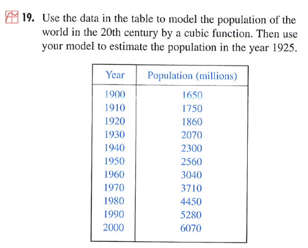

A Fitting Problem
========================================================
```{r warming=FALSE,message=FALSE,echo=FALSE,results="hide",label="options",echo=FALSE}
require(knitr, quietly=TRUE)
opts_chunk$set(fig.width=3,fig.height=3,out.width="60%",dev="svg")
library(mosaic,quietly=TRUE)
trellis.par.set(theme=col.mosaic())
```

A problem from Stewart *Calculus: Concepts and Contexts* 2/e p. 38.  It appears in Chapter 1.  



* Why use "estimate" rather than "interpolate"?
* What are the essential properties of the function needed to create a reasonable interpolation?
* What's the point of using a cubic?  
* How would you decide whether to use a cubic or some other function?  

Using ```mosaic```
------------------
* Start R
* Load the package (you need do this only at the start of a session)
```{r eval=FALSE}
require(mosaic)
```
* Read in the data and display a bit
```{r}
pop = fetchData("PREP-Stewart-World-Population.csv")
head(pop)
```

What skills are needed to do this?  Careful spelling, attention to punctuation, use of quotes, understanding the structure of a file name, understanding the syntax for use of R functions, understanding assignment.

* Plot the data
```{r label="world-pop-plot"}
plotPoints( Population ~ Year, data=pop )
```

What do you need to know to answer the questions posed earlier?

Some techniques:

#### Fit a quadratic
```{r}
quadf = fitModel( Population ~ a*Year^2 + b*Year + c, data=pop)
quadf(1925)
quadfResids = with(pop, Population - quadf(Year))
```

#### Fit a cubic

You figure it out!

#### Fit a Spline
```{r}
splinef = spliner( Population ~ Year, data=pop)
splinef(1925)
splinefResids = with(pop, Population - splinef(Year))
```

You can also try a monotonic spline.  Use ```help(spliner)``` to find out how.

#### Fit an Exponential
This is hard, for reasons that relate to the data and numerics.  Here, a guess is being made for a doubling time of 30 years.
```{r}
expf = fitModel( Population ~ A + B*2^((Year-1900)/30), data=pop)
```

According to this model, what's the population in 1925?

### QUESTIONS
* Why are there so many extra parameters in the functions?  Why not just ```a*Year^3``` for the cubic?
* Which function is right?
* How well do the various functions work for extrapolation?  Look up the world population in 2010 and check.  Also, look up the world population in 1500 and check.
* What factors might influence world population that might mean that the rules of growth in 2000 might be different than 1900?  If the system is changing, why can a mathematical function that doesn't change in form over the years capture the dynamics of population?
* Suppose that your job is to predict the world population in 2020.  How would you build a model for this purpose?

