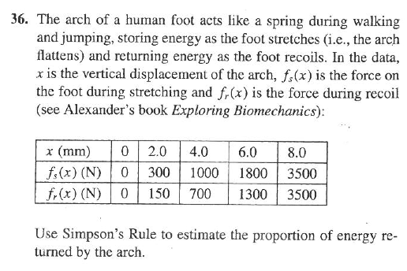
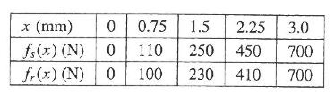

Here is a problem from Smith & Minton, *Calculus: Early Transcendental Functions* 3/e:



This is a nice setting for a calculus problem.  It might also reinforce notions of the integral if it can be successfully conveyed to the student why energy is stored and returned and what this has to do with the integral.  But the calculations are essentially rote.  The only judgement to be made is which integral to subtract from which.

It might be helpful to give a more thorough explanation of the energy biomechanics.  For instance:
<blockquote>
<p>Each time your foot touches the ground when taking a step, the arch of your foot is stretched like a spring as the arch is stretched and flattened.  Like a spring, energy is stored in the arch.  The amount of energy stored is force-times-distance, which corresponds to the integral of the force versus displacement function.</p>

<p>As you lift your foot from the ground --- the recoil phase --- the energy stored in the arch is returned.  Effectively, the spring is pushing back on the ground --- like a ball rebounding --- and returning some of the energy that was stored in the downward phase of the step.</p>

<p>An ideal spring would return all the energy that was stored.  The muscles and joints of the foot use up some of the energy in friction, so not all of the energy is returned.  You can estimate the amount of energy that is lost from data on force versus displacement data in the stretch and recoil phases of the step.</p>
</blockquote>

As a modeling example, one should draw attention to the intersection of the curves and the monotonic nature of the relationship.  


```r
foot = data.frame(disp = c(0, 2, 4, 6, 8), Fstretch = c(0, 300, 1000, 
    1800, 3500), Frecoil = c(0, 150, 700, 1300, 3500))
plotPoints(Fstretch ~ disp, data = foot)
plotPoints(Frecoil ~ disp, data = foot, add = TRUE, col = "red")
```

 


The energy returned by the arch is the integral of the recoil curve.  The total energy is the integral of the stretch curve.  

The two curves match at maximum displacement and zero displacement.  Insofar as this stems from the physiology/biomechanics of the situation, a model of the relationship between force and displacement ought to incorporate it.  In addition, it's reasonable to expect that force increases with displacement.


Here are two different interpolators of the recoil and stretch relationships:


```r
stretchSpline = spliner(Fstretch ~ disp, data = foot, monotonic = TRUE)
recoilSpline = spliner(Frecoil ~ disp, data = foot, monotonic = TRUE)
stretchLinear = connector(Fstretch ~ disp, data = foot)
recoilLinear = connector(Frecoil ~ disp, data = foot)
plotPoints(Fstretch ~ disp, data = foot)
plotPoints(Frecoil ~ disp, data = foot, add = TRUE, col = "red")
plotFun(stretchSpline(disp) ~ disp, add = TRUE)
plotFun(recoilSpline(disp) ~ disp, add = TRUE, col = "red")
plotFun(stretchLinear(disp) ~ disp, add = TRUE)
plotFun(recoilLinear(disp) ~ disp, add = TRUE, col = "red")
```

 


### QUESTIONS
1. What parametric functional forms might be useful for modeling the force/displacement relationships displayed by the data?  Construct an example that can be fitted to the data. Does your fitted function match for stretch and recoil at displacement 0 and 8?
2. It's claimed that the straight-line interpolator tends to over-estimate the force.  What features of the straight-line form are physically unrealistic?  Why would a more realistic curve tend to be below the straight-line form between the data points?
3. Do the integrals to find the energy stored during stretch and the energy returned during recoil.  What are the units of the energy?  
4. What fraction of the stored energy is returned?  How does your result depend on whether the straight-line or spline form is used in the integral?
5. What feature of the graph corresponds to the amount of energy lost?
5. When you are standing on one foot, stationary, what is the force between your foot and the ground? 

### Non-Monotonic?

Construct a "natural" spline going through the data.  In this model, is there any value of displacement for which the force decreases with increasing displacement?


## The Wallaby

Here's data on the Wallaby from the same source as the human foot data.



Questions:
1. Which creature returns a greater fraction of energy through the arch, a human or a wallaby?
