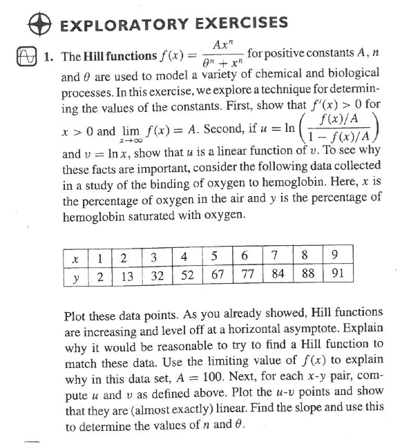
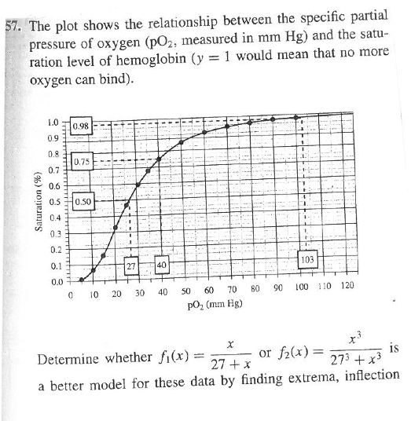

Fitting Hill Functions
========================================================
Here is a problem from Smith & Minton, *Calculus: Early Transcendental Functions* 3/e:



* What techniques are being used to estimate the parameters of the Hill function?

We're going to revisit the problem using least-squares modeling.

```{r echo=FALSE,results="hide",label="options"}
require(knitr, quietly=TRUE)
opts_chunk$set(fig.width=3,fig.height=3,out.width="3in")
```

```{r warning=FALSE,error=FALSE,message=FALSE,results="hide"}
library(mosaic,quietly=TRUE)
trellis.par.set(theme=col.mosaic())
```


```{r label="rawdata"}
hemo = data.frame( air=c(1,2,3,4,5,6,7,8,9),
                   hemoglobin=c(2,13,32,52,67,77,84,88,91))
plotPoints( hemoglobin ~ air, data=hemo)
```

## Fitting Hill Functions

We can try various Hill functions fitted to the data.  Here's one with exponent $n=2$:
```{r label="fit-n2"}
f2 = fitModel( hemoglobin ~ A*air^2/(theta^2 + air^2), data=hemo,
               start = list(A=100, theta=4) )
plotFun( f2(air)~air, air.lim=range(0,12))
plotPoints( hemoglobin ~ air, data=hemo, add=TRUE )
```

### QUESTIONS
1. Note the starting values guessed for the parameters.  Explain how these parameters are related to the shape of the function.
1. What features of this fitted function with $n=2$ are good, what features are bad?  Are the fitted parameter functions reasonable?
2. Fit a Hill function with $n=1$.  Is this better?  How about $n=3$? How about $n=5$?
3. What criteria would you use in choosing the best $n$?  Give a reasonable criterion in terms of how well the data points fall on the function.  Also give a criterion expressed in terms of what you know physically about the possible values of $A$.

## Fitting the Exponent

Of course, $n$ itself is a parameter and we can include it among the parameters to be found.

```{r label="fit-n"}
fn = fitModel( hemoglobin ~ A*air^n/(theta^n + air^n), data=hemo,
               start = list(A=100, theta=4, n=3) )
plotFun( fn(air)~air, air.lim=range(0,12))
plotPoints( hemoglobin ~ air, data=hemo, add=TRUE )
```

## The Residuals

The residuals are the difference between the actual values of the output variable and the model function.  You can calculate them by putting the data values for the input (air, in this case) into the model function.

```{r label="resid"}
resids = with(hemoglobin - fn(air), data=hemo)
```

One way to quantify the typical size of a residual is with the "root mean square".
```{r label="RMS"}
sqrt( mean( resids^2 ))
```

### QUESTIONS: 
1. Calculate the root mean square for exponents $n=1,2,3,5$ and compare them to the RMS for the fitted value of $n$.

## Confidence Intervals Project

When fitting the function to the data, the parameters are reported by the computer to many digits.  This suggests an estimate of high precision, but that's misleading.

Your Project:
1. Find a typical size of a residual.  This provides a rough estimate of the measurement error in the data.
2. Generate random numbers of that size and add them to the output variable.
3. Refit the model.
4. Do this many times to see the likely range of fitted parameters.

## Extrema and Inflection Points?

Here is a problem from Smith & Minton, *Calculus: Early Transcendental Functions* 3/e:




Read the data from the graph and plot the data.  Then use the data to fit a Hill function, using all three parameters $A$, $n$, and $\theta$.  

Given a theoretical view that that saturation should be 100% for large pO_2, add in several "data points" with large pO_2 and saturation exactly 100%.  Do these change the fit in any substantial way?


