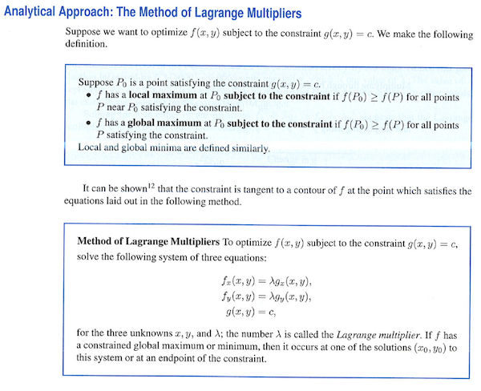
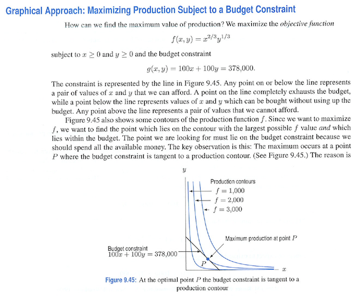

Lagrange Multipliers
========================================================

Here's part of the explanation of constrained optimization from Hughes-Hallett et al. *Applied Calculus* 4/e (p. 383):

-------------------
#### QUESTION

Why does this method work?

-------------------

This is an introduction to an algorithm for solving constrained optimization problems.

Before introducing an algorithm, better to introduce some context and concepts:
* Objective and constraint functions.  Why do we distinguish?
* The constraint has an impact (sometimes) on the output of the objective function.  What's the relationship?  (Shadow prices)

------------------

Here's another explanation from the same book (p. 382).  

This makes it clearer why there is a tangency relationship at the optimum.  But it still treats the constraint as an equation rather than as a function.

