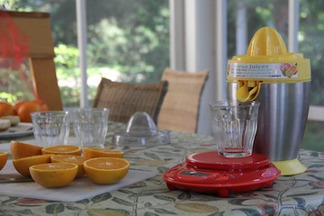

Measuring Flow (of Orange Juice)
========================================================

```{r echo=FALSE,results="hide",label="options",include=FALSE}
require(knitr, quietly=TRUE)
opts_chunk$set(fig.width=3,fig.height=3,out.width="60%",dev="svg")
library(mosaic,quietly=TRUE)
trellis.par.set(theme=col.mosaic())
```

<script src="https://ajax.googleapis.com/ajax/libs/jquery/1.7.1/jquery.min.js"></script>
<script src="../../javascripts/main.js"></script>



[This video](http://youtu.be/bYlrKi7rJNA) shows an orange juicer at work.  As the oranges are being juiced, the amount of juice accumulated is being measured by a scale.

<iframe width="420" height="315" src="http://www.youtube.com/embed/bYlrKi7rJNA" frameborder="0" allowfullscreen></iframe>

Watch the video and record the scale reading versus time in a spreadsheet.  You'll have to decide how often to record the measurement.


### Splining the Data
Once you've got the data, construct a function by splining through them.

1. Construct a "natural" spline of the data.
2. Construct a "monotonic" spline of the data.

Are the two splines substantially different in value?


### Measuring Flow

The data show the accumulated juice versus time.  Transform the accumulated-juice function to produce a function showing flow versus time.

1. What's a good estimate of the maximum instantaneous flow of juice?
2. What's the average flow?  What fraction of the time is the flow less than 20% of the average flow?
3. Imagine that you were trying to squeeze many oranges and wanted to develop a policy for when to stop processing each orange.  The policy will be based on when the flow falls below a certain level.  Propose an appropriate level and try to estimate how much time will be saved and how much juice will be lost.

### Studying Splines

1. Using a "natural spline" through the data, is there any time when the function shows the flow is negative?  
2. Use a "monotonic spline" through the data.  Compare the flow measured from the natural spline and the monotonic spline.  Are there evident differences?  
3. Examine the 2nd and 3rd derivatives of the two kinds of splines.  Are the derivatives continuous?  Are the derivatives differentiable?


#### Production Credits
Videographer: Randall Pruim

Cast:
* The Hand: Daniel Kaplan
