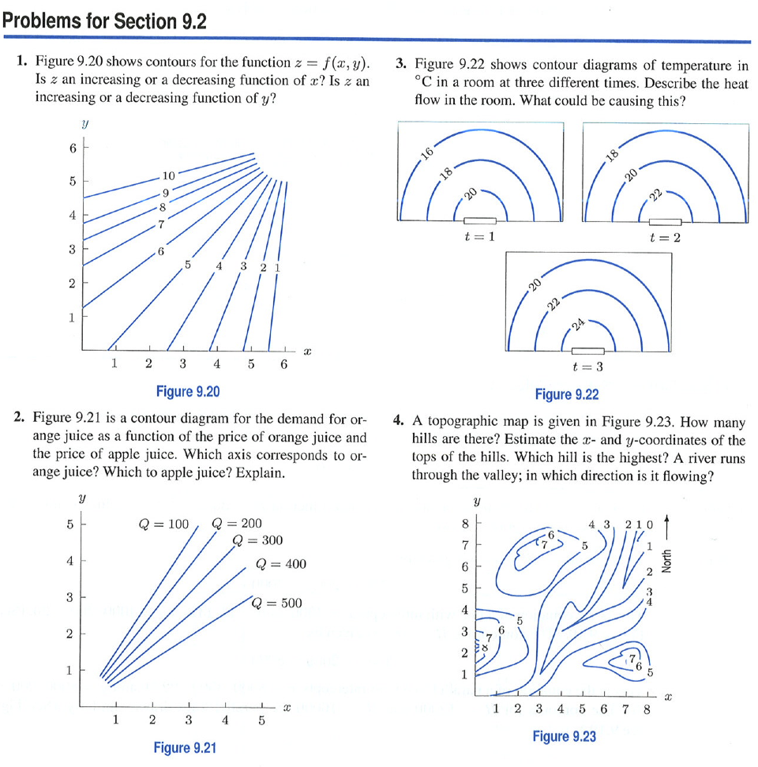
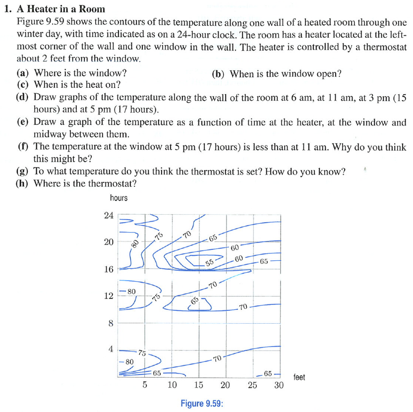

Introducing Functions of Multiple Variables
========================================================

```{r echo=FALSE,results="hide",label="options",include=FALSE}
require(knitr, quietly=TRUE)
opts_chunk$set(fig.width=3,fig.height=3,out.width="60%",dev="svg")
library(mosaic,quietly=TRUE)
trellis.par.set(theme=col.mosaic())
```

<script src="https://ajax.googleapis.com/ajax/libs/jquery/1.7.1/jquery.min.js"></script>
<script src="../../javascripts/main.js"></script>

To judge from the conventional curriculum, one needs to master functions of one variable before tackling functions of two variables.
* Real-world relationships generally involve more than two quantities.
* Understanding confounding and covariates --- important when dealing with data --- requires understanding relationships between more than two quantities.
* People seem to have little trouble reading contour plots: hiking, the weather
* Intuitive notions of slope are based on the physical landscape; the ground is a relationship between elevation, latitude, and longitude: elevation is a function of latitude and longitude.
* Functions of one variable are often defined implicitly, e.g. budget constraint functions, volume/pressure relationships.  

The June 29 Derecho
-------------------
The composite parameter, used to predict derechos:


A graph showing the probability that a meso-scale disturbance will maintain itself:

<blockquote>
Once a mesoscale convective system (MCS) develops, a common parameter to analyze is the MCS maintenance parameter.  This parameter uses many variables to analyze whether an MCS which has already formed will maintain itself.  In the image capture below, the probability was over 90% and indeed this derecho maintained itself all the way to the Atlantic Ocean!
</blockquote>

How often do derechos occur?


Here's a relationship shown between 3 input variables (latitude, longitude, time) and an output variable (cloudiness).  

<iframe width="350" height="197" src="http://www.youtube.com/embed/2xjmUZq4I7M?rel=0" frameborder="0" allowfullscreen></iframe>

## How to introduce functions of multiple variables.

Strategy:
* Start with functions of two variables.  These are easily displayed.
* Use the contour plot rather than the surface representation.  Why?  It's much easier to do calculations on the contour plot.
* Build on students' intuition about the landscape.  Be explicit about this.  Ask what kind of geographical feature different sorts of functions correspond to. Have students go for conceptual walks through the landscape.
* Think locally.  Egg-carton functions may be enticing, but they are complicated.  Work with simple, local landscape features:
    1. A mountain top
    2. A bowl
    3. The side of a hill
    4. An ampitheater (or bay)
    5. A ridge
    6. A valley
    7. A mountain pass (or saddle)
* Introduce "solving" simply --- find the zeros of one function in one variable.  Point out that the zero contour tells you the location of such points; there are many of them.  The algorithm for solving is simple, simple, simple: walk downhill until your feet get wet.  Then you know you are at sea level.  There are many such points: the whole coastline.
* Introduce slope and show how it depends on direction. Introduce gradient as the slope in the steepest direction.
* Introduce slope in the cardinal directions (partial derivatives).
* Relate the partial derivatives to the important form of question, "How does A change with B, holding everything else constant?" 
* Once students are comfortable with functions of two variables, introduce functions of three variables, e.g. temperature as a function of latitude, longitude, and elevation.  Show that the contours are surfaces.  This will freak students out.
* Then move on to situations where the functions are of many variables.  Show that the formal methods let us think about these functions without having to graph them, particularly the partial derivative and the important form of reasoning "holding everying else constant."
* Provide a functional form that's capable of representing the simple landscape features: the quadratic polynomial.  Show how to construct such a polynomial from data.  
* In calculus, show how the choice of terms in the quadratic polynomial can be made based on a qualitative understanding of relationships: Is there an internal maximum or minimum? Is there an interaction?
* Provide a way to quantify how well the approximation matches the data.  Ideally, make a connection to the statistical problem of how the data can inform the selection of model terms.


### Activity: Describe your Landscape

In this activity, each student generates his or her own landscape in two dimensions.  Then they describe it using geographical terms.

The landscape is generated with the ```rfun()``` operator, which generates a "random" function based on the numerical seed provided.  It's easy to have students use their birthday as the seed, e.g., April 10, 1994 is 19940410.  

```{r label="April10"}
f = rfun( ~x+y, seed=19940410)
plotFun(f(x,y)~x+y, x.lim=c(-5,5),y.lim=c(-5,5))
```

After describing the landscape, add a path and ask for a description of the slope walking along the path.
* A path running W-E
* A path running N-S
* Where the two paths intersect, are the slopes along the individual paths necessarily the same?

### Additional Path-Related Problems

Here are some nice problems from Hughes-Hallett et al., *Applied Calculus* 4/e (p.360):



In answering Problem 2, students need to think about how the demand for orange juice depends on the price of orange juice and on the price of apple juice.  They generally have an easier time thinking about this verbally without reference to the graph.



### Some settings

* Cobb-Douglas Production Function [http://rpubs.com/dtkaplan/543 introductory write-up]
* Can you see the effect of electricity usage in the <code>utilities.csv</code> data?  Look only at the winter months.
* Path integrals and the ideal gas law
