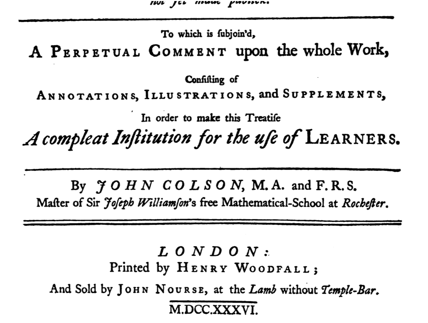

###  What is calculus? 

* Ask students who has taken calculus already.  What's it about?  They will say "integrals" and "derivatives."  Ask them what these are for?  When they say "areas," ask how often they have a problem involving areas (outside of a math course).  Why are areas so important, then? 
* A strategy for turning descriptions of parts into wholes, and for taking wholes apart into parts.
    *Sometimes it's easy to describe things in terms of parts.  Examples:  Whole: What's the size of the US economy?  (Few people can say.)  What's the growth rate? (Many people know something reasonable.)  Whole: What will be the population in 2050?  Part: How many people will be born and will die this year?  Whole: How many people will get the flu?  Part: For each person who gets the flu, how many new people, on average, will catch it from him or her?
* Ask what the word "calculus" means.

###  A little of the history of calculus 

* Method of exhaustion and limits from 400-200BC.  Example problem: What's the area of a circle?

<figure>

<figcaption>Method of Exhaustion</figcaption>
</figure>

* Newton's book from 1736. Note the vocabulary: functions or variables are "fluents", derivatives are "fluxions":

Newton's Calculus Book

An important part of mathematical calculus is about exactitude and precise statement.  But starting with Newton, calculus became a language for describing the world, one that formalizes the distinction between "change" and "state."   The emphasis of this course is on the uses for calculus in describing, creating representations of parts of the real world that are of broad interest, and using those representations to extract useful information: Modeling.

###  Advising en masse: Should you be in this course?  

* If you are prepared to take Single Variable or Multivariable, and you will eventually take multivariable or linear algebra, then you don't necessarily need to be in this course.

###  The Strategy of Calculus  

Information comes in different forms.  One form is "position."  Another form is "change." Calculus provides tools for relating the two with the insight that "change" can be *accumulated* to give position, and "position" can be *differentiated* to give change.

1. [The billiards problem](http://dl.dropbox.com/u/5098197/Math135/In-Class/draw-billiards.pdf) 
1. Some modeling exercises: 
    * Counting dots [[MacMath135_Modeling_Examples#Counting | dots]], 
    * Capacity of light rail [[MacMath135_Modeling_Examples#Planning_for_Light_Rail | capacity of light rail]], 
    * [Cars through an intersection](http://dl.dropbox.com/u/5098197/Math135/In-Class/road-capacity.pdf) 

###  Administrative  

1. Show the [[Pub114|wiki page schedule]].  Have them bookmark this.
1. Show the Moodle site.  You won't need this very much, just for handing in a few reports during the semester.
   * Did you upload your picture?
1. Grades.  Don't look at the cumulative score on Moodle.  It's irrelevant.  Each graded component of the course will come with an indication of what score is "good."  If your score is below this, there's action that needs to be taken.  If your score is above this, then move on.  If you are keen to get an A or A- in the course, then keep in mind that at Macalester approximately 50% of grades are either A or A-.  So, if you are in the top 1/4 of scores, that's a rough indication that your letter grade on that item is A.  
1. AcroScore for Wednesday.  But show them where their login ID is.

###  Review of the topics of the course  

Central themes: modeling and computation, both symbolic and numeric.

1. Functions and Computing with Runctions
1. Units, Dimensions, Scaling, and Estimation
1. Linear Algebra
1. Derivatives and Integrals
1. Optimization
1. Differential equations
1. Quick introduction to R and RStudio: *Start R in Calculus*
